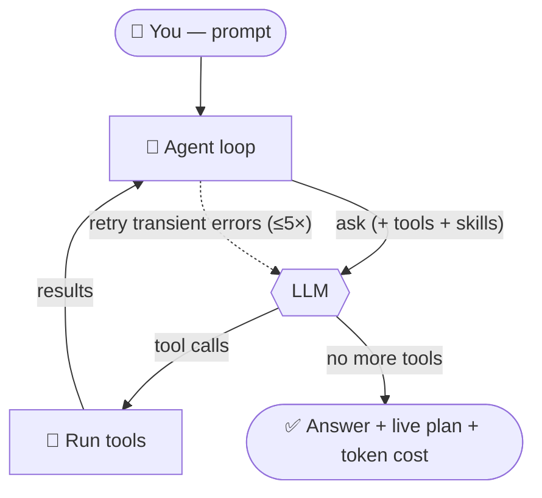
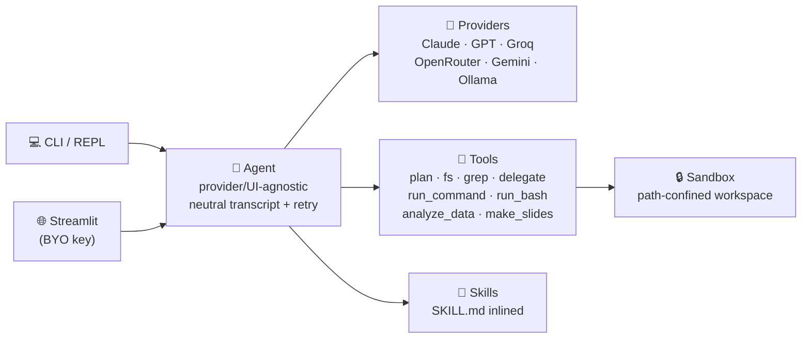

<h1 align="center">🤖 pi-agent</h1>

<p align="center">
  <em>A minimal, transparent AI coding agent — multi-provider (paid · free · local),<br/>
  sandboxed, with a planner, sub-agents, skills, data analysis, and slide generation.</em>
</p>

<p align="center">
  <a href="https://github.com/Ashutosh0428/pi-agent/actions/workflows/ci.yml"></a>
  <a href="https://www.python.org/"></a>
  <a href="LICENSE"></a>
  <a href="https://mj3ivlmagpfgsjpxirxbpv.streamlit.app/"></a>
</p>

<p align="center">
  <b><a href="https://mj3ivlmagpfgsjpxirxbpv.streamlit.app/">🚀 Try it live</a></b> &nbsp;·&nbsp;
  <a href="#-run-it-locally">Run locally</a> &nbsp;·&nbsp;
  <a href="#-skills">Skills</a> &nbsp;·&nbsp;
  <a href="#-architecture">Architecture</a>
</p>

---

pi lets an LLM **read, edit, and run code** in your working directory through a
tool-use loop — and shows you everything it does. It speaks to **Claude, GPT,
free models (Groq · OpenRouter · Gemini), and local Ollama** through one
provider-neutral core. Inspired by the [Pi](https://github.com/badlogic/pi-mono)
philosophy: lean, hackable, no bloat.

> Built as a learning + portfolio project. The core loop is ~150 lines; the
> transcript is provider-neutral, so adding a tool *or a model* is trivial.

## 🔁 How it works



The model plans, calls tools, observes the results, and repeats until done —
streaming text, a live to-do checklist, and the running token cost as it goes.

## ✨ Features

| | |
|---|---|
| 🧠 **Multi-provider** | Claude · GPT · **Groq** · **OpenRouter** · **Gemini** (free) · **Ollama** (local, no key) — switch mid-chat with `/model` |
| 📋 **Planner + live todos** | declares a plan via `update_plan`; the web app renders a live ⬜→⏳→✅ checklist |
| 🤝 **Sub-agents** | `delegate` a focused subtask to a sequential sub-agent (no recursion) for big jobs |
| 📦 **Project ZIP upload** | drop a zipped repo (zip-slip-safe) → *"explain this project"* (purpose, flow, components) |
| 📊 **Data analysis** | `analyze_data` profiles a CSV/Excel like a data scientist (stats, missing %, correlations) |
| 📑 **Slide generation** | `make_slides` builds a downloadable `.pptx` from an outline |
| 🔁 **Resilient** | transient errors (429/5xx/timeout) auto-retry ≤5× w/ backoff; bad key/request fail fast |
| 🌊 **Streaming + cost** | token-by-token streaming, per-turn token counts, estimated session cost (`/cost`) |
| 📜 **Skills** | `SKILL.md` files inlined into the prompt — 12 bundled, add your own with zero code |
| 🔒 **Sandboxed & safe** | paths confined to the workspace; public web demo runs no raw shell |

**Tools:** `update_plan` · `delegate` · `read_file` · `write_file` · `edit_file` ·
`list_dir` · `grep` · `run_command` (restricted, public-safe) · `run_bash` (full
shell, local only) · `analyze_data` · `make_slides`.

## 🚀 Run it locally

```bash
git clone https://github.com/Ashutosh0428/pi-agent && cd pi-agent
pip install -e ".[openai]"          # core + OpenAI/Groq/OpenRouter/Ollama
pip install -e ".[openai,data]"     # add data analysis + slides (pandas, python-pptx)
```

Pick a provider and set its key (env var, or `cp .env.example .env`):

| Provider | Cost | Setup |
|---|---|---|
| Anthropic | paid | `export ANTHROPIC_API_KEY=sk-ant-...` |
| OpenAI | paid | `export OPENAI_API_KEY=sk-...` |
| Groq | 🆓 free | `export GROQ_API_KEY=...` · [get a key](https://console.groq.com/keys) |
| OpenRouter | 🆓 free | `export OPENROUTER_API_KEY=...` · [get a key](https://openrouter.ai/keys) |
| Gemini | 🆓 free + paid | `export GEMINI_API_KEY=...` · [get a key](https://aistudio.google.com/apikey) |
| **Ollama** | 🆓 local, no key | install Ollama → `ollama pull llama3.1` (runs at `localhost:11434`) |

**Any model works** — `--model` takes any id the provider offers, free or paid:
`gemini-2.0-flash` (free) / `gemini-2.5-pro` (paid), `gpt-4o-mini` / `gpt-4o`,
`claude-haiku-…` / `claude-opus-…`, `llama-3.3-70b-versatile`, etc.

```bash
pi                                                          # interactive REPL (defaults to Claude)
pi --provider groq --model llama-3.3-70b-versatile "explain this repo"
pi --provider gemini --model gemini-2.0-flash "summarise what this project does"
pi --provider ollama --model qwen2.5-coder:7b "write a string-reverse fn and a test"
pi --skills-dir ./skills "review src/pi_agent/llm.py"
pi --no-shell                                               # safe mode (disable run_bash)
```

REPL commands: `/help` · `/tools` · `/model <id>` · `/think` · `/cost` · `/reset` · `/exit`.

> **Keys never touch the repo** — read from the environment only, never stored or
> logged; `.env` is gitignored.

### 🖥️ Why Ollama instead of a cloud AI tool (Copilot / ChatGPT / Cursor)?

- 🔒 **Private** — your code never leaves your machine. Ideal for proprietary/regulated code you can't paste into a cloud tool.
- 💸 **Free, no limits** — no key, no per-token bill, no rate limits, no subscription.
- 📴 **Offline** — works on a plane or air-gapped network.
- ⚖️ **Honest trade-off** — local models are smaller/slower than frontier Claude/GPT; great for everyday review/refactor, switch to a cloud model (one flag) for the hardest reasoning.

## 🌐 Web demo

A public-safe slice of pi ([live](https://mj3ivlmagpfgsjpxirxbpv.streamlit.app/)) — or run it yourself:

```bash
pip install -r requirements.txt
streamlit run streamlit_app.py      # http://localhost:8501
```

- **Bring your own key** — used only for the session; never stored, logged, or committed.
- **No raw shell** — visitors get `run_command` (read-only allowlist, no network, sandboxed) instead of `run_bash`.
- **Upload a file, a project `.zip`, or a CSV** — then *review*, *explain the project*, or *analyze the data and make a deck*.
- **Sandboxed** — file tools + ZIP extraction confined to a fresh per-session temp dir (zip-slip-guarded).

Locally the web app can also reach **Ollama**; the hosted demo can't (no localhost
Ollama on the cloud server).

## 🧩 Architecture



```
src/pi_agent/
  config.py        # AgentConfig + system prompt
  sandbox.py       # path-safety boundary (the security choke-point)
  llm.py           # provider registry + neutral transcript ↔ each wire format; usage/cost
  agent.py         # the tool-use loop: ReAct, retry, delegate (provider/UI-agnostic)
  skills.py        # load SKILL.md files, inline them into the system prompt
  upload.py        # zip-slip-safe project extraction
  repl.py          # terminal front-end (rich): streaming, /model, /cost, /think
  cli.py           # `pi` entry point
  tools/
    base.py registry.py        # Tool spec + dispatch
    planning.py                # update_plan (live todos)
    filesystem.py search.py    # read/write/edit/list + grep
    shell.py safe_exec.py      # run_bash (local) + run_command (public-safe)
    subagent.py                # delegate
    datasci.py                 # analyze_data + make_slides
streamlit_app.py   # public web demo (BYO key, no shell, temp sandbox)
skills/            # 12 SKILL.md skills
```

The agent keeps its transcript **provider-neutral** (`user` / `assistant` /
`tool`); each provider translates it to its own wire format (Anthropic content
blocks vs OpenAI `tool_calls`). That single seam is what lets one conversation
move between Claude, GPT, Groq, OpenRouter, and Ollama — even mid-chat.

## 📜 Skills

A *skill* is a `SKILL.md` describing how to do one task well; pi inlines a skill
index + contents into the system prompt, so the model applies them without
spending a tool call to read them.

```
skills/<name>/SKILL.md   # frontmatter (name, description, trigger) + When / How / Avoid / Done-well
```

Bundled (12): `planning` · `orchestrate` · `write-tests` · `code-review` ·
`refactor` · `debug` · `explain-code` · `explain-project` · `architecture` ·
`write-docs` · `data-analysis` · `make-deck`. Add your own by dropping a new
folder — no code changes.

## 🛠️ Extending it (the whole point)

**Add a tool** — write a handler + a `Tool`, register it:

```python
Tool(
    name="word_count",
    description="Count words in a file.",
    input_schema={"type": "object", "properties": {"path": {"type": "string"}}, "required": ["path"]},
    handler=lambda args, sb: str(len(sb.resolve(args["path"]).read_text().split())),
)
```

**Add a provider** — implement `LLMProvider.complete(...)` (translate the neutral
transcript, call the API, return an `AssistantResponse`). The agent loop is unchanged.

## ✅ Testing

```bash
pytest          # 69 tests — scripted fake provider, no API key, no network
```

Covers the sandbox boundary, every tool, the agent loop (tool execution,
max-iteration guard, confirmation, events, usage, retry, delegation), the
provider translators, and zip-slip safety.

## 🗺️ Roadmap

- More tools (git, web fetch, apply-patch)
- OpenAI/Groq streaming (Anthropic streams today)
- Charts in `analyze_data`; skill auto-selection by relevance

---

<p align="center"><em>Built by Ashutosh Sharma.</em></p>
